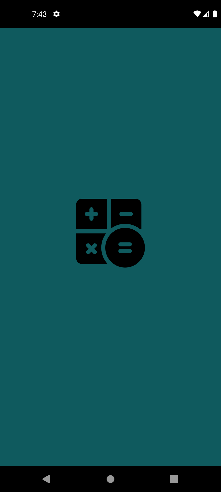
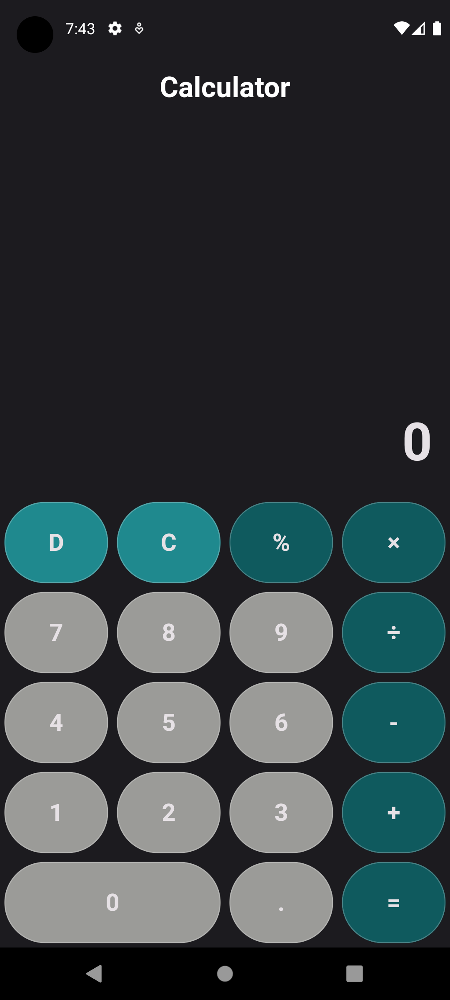
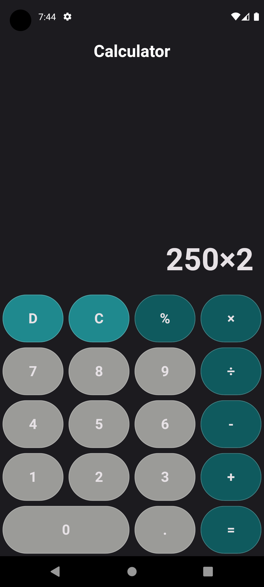

# Calculator Application

## Overview

The **Calculator Application** is a user-friendly and efficient calculator app developed by Idham Atta. It allows users to perform basic arithmetic operations with ease. This application is built using Flutter and offers a simple, intuitive interface that ensures a smooth user experience.

## Features

- **Basic Arithmetic Operations:** Perform addition, subtraction, multiplication, and division.
- **Clear Button:** Easily clear the current input and start fresh.
- **Responsive Design:** Adapts to various screen sizes for a consistent experience on different devices.

## Screenshots

<!-- Add paths to your screenshots here -->




## Installation

To get started with the Calculator Application, follow these steps:

1. **Clone the Repository:**

    ```sh
    git clone https://github.com/your-username/calculator_app.git
    ```

2. **Navigate to the Project Directory:**

    ```sh
    cd calculator_app
    ```

3. **Install Dependencies:**

    ```sh
    flutter pub get
    ```

4. **Run the Application:**

    ```sh
    flutter run
    ```

## Usage

- **Perform Calculations:** Use the on-screen buttons to enter numbers and perform calculations.
- **Clear Input:** Press the 'C' button to clear the current input.

## Code Structure

The main components of the application are structured as follows:

- **main.dart:** Entry point of the application.
- **calculator_screen.dart:** Contains the main UI and logic for the calculator screen.
- **button_values.dart:** Defines the values and labels for the calculator buttons.

## Contributing

Contributions are welcome! Please fork the repository and submit a pull request with your changes. Ensure that your code adheres to the project's coding standards and includes appropriate tests.

## Contact

For any questions or suggestions, feel free to contact Idham Atta at idhamatta2706@gmail.com.
